# Two-Tier Flask Web Application with CI/CD

A production-ready two-tier web application demonstrating modern DevOps practices with automated deployment using GitHub Actions, Docker containerization, and AWS cloud infrastructure.

## 🎯 Project Overview

This project implements a complete two-tier architecture where the application logic (Flask backend) and data persistence (MySQL database) are separated into distinct layers. The entire stack is containerized using Docker, orchestrated with Docker Compose, and automatically deployed to AWS EC2 through a GitHub Actions CI/CD pipeline.


## 🧱 Architecture Diagram

```mermaid
flowchart LR
    %% Left pipeline
    DEV[Developer<br/>Pushes code changes]
    REPO[GitHub Repository<br/>Source code management]
    GHA[GitHub Actions<br/>CI/CD automation]

    DEV --> REPO --> GHA

    %% EC2 boundary
    subgraph EC2[AWS EC2 Instance<br/>Ubuntu server]
      direction TB

      DC[Docker Compose<br/>Container orchestration]

      subgraph APP_TIER[Application Tier]
        FLASK[Flask App<br/>Python backend<br/>Port 5000]
      end

      subgraph DATA_TIER[Data Tier]
        MYSQL[MySQL Database<br/>Persistent data storage<br/>Port 3306]
      end

      DC --> FLASK
      FLASK <--> |Database connection| MYSQL
    end

    GHA -->|SSH connection| DC

    %% Styling
    style DEV fill:#4b3fb5,stroke:#8b7dff,color:#ffffff,stroke-width:1px
    style REPO fill:#0b4d8c,stroke:#4aa3ff,color:#ffffff,stroke-width:1px
    style GHA fill:#7a4a00,stroke:#d28b00,color:#ffffff,stroke-width:1px

    style EC2 fill:#0b6b5a,stroke:#3ad2b2,color:#ffffff,stroke-width:1px
    style DC fill:#2e7d32,stroke:#8bc34a,color:#ffffff,stroke-width:1px

    style APP_TIER fill:#8a2d0f,stroke:#ff8a65,color:#ffffff,stroke-width:1px
    style FLASK fill:#2f2f2f,stroke:#9e9e9e,color:#ffffff,stroke-width:1px

    style DATA_TIER fill:#7b1f49,stroke:#f06292,color:#ffffff,stroke-width:1px
    style MYSQL fill:#2f2f2f,stroke:#9e9e9e,color:#ffffff,stroke-width:1px
```




## ✨ Key Features

- **Automated Deployments**: Push to GitHub triggers instant deployment to production
- **Container Orchestration**: Docker Compose manages multi-container application lifecycle
- **Zero-Downtime Updates**: Graceful container restarts during deployments
- **Persistent Storage**: MySQL data survives container recreation
- **Environment Isolation**: Development and production configurations separated
- **Security Best Practices**: SSH keys stored in GitHub Secrets, EC2 security groups configured
- **Health Monitoring**: Database health checks ensure service readiness
- **Scalable Design**: Easy to extend to three-tier with separate frontend

## 🛠️ Tech Stack

| Component | Technology | Purpose |
|-----------|-----------|---------|
| **Backend** | Flask (Python) | Lightweight web framework for API development |
| **Database** | MySQL 5.7 | Relational database for structured data |
| **Containerization** | Docker | Environment consistency and portability |
| **Orchestration** | Docker Compose | Multi-container management |
| **CI/CD** | GitHub Actions | Automated build and deployment pipeline |
| **Cloud Platform** | AWS EC2 | Scalable compute infrastructure |
| **Operating System** | Ubuntu 24.04 LTS | Stable Linux distribution |
| **Version Control** | Git & GitHub | Source code management |

## 📋 Prerequisites

Before you begin, ensure you have the following installed:

### Local Development
- Python 3.9 or higher
- Docker Desktop (version 20.10+)
- Docker Compose (version 2.0+)
- Git

### Cloud Infrastructure
- AWS Account with EC2 access
- SSH key pair for EC2 instance
- GitHub account


## 📁 Project Structure

```
Two-Tier-Flask-App---GitHub-Actions/
├── .github/
│   └── workflows/
│       └── deploy.yml          # GitHub Actions CI/CD pipeline
├── static/
│   ├── css/
│   │   └── style.css           # Frontend styling
│   └── js/
│       └── script.js           # Frontend JavaScript
├── templates/
│   └── index.html              # Main application page
├── app.py                      # Flask application entry point
├── requirements.txt            # Python dependencies
├── Dockerfile                  # Docker image configuration
├── docker-compose.yml          # Multi-container orchestration
├── .gitignore                  # Git ignore rules
└── README.md                   # Project documentation
```

## 🔄 CI/CD Pipeline Flow

1. **Developer Action**: Code is pushed to GitHub repository
2. **Trigger**: GitHub Actions workflow is automatically triggered
3. **Authentication**: Workflow authenticates to EC2 using SSH key from secrets
4. **Code Pull**: Latest code is pulled from the repository to EC2
5. **Container Management**:
   - Existing containers are stopped and removed
   - Docker Compose builds new images
   - New containers are started with updated code
6. **Health Check**: MySQL container health is verified
7. **Deployment Complete**: Application is live with new changes


## 🤝 Contributing

Contributions are welcome! Please follow these steps:

1. Fork the repository
2. Create a feature branch (`git checkout -b feature/AmazingFeature`)
3. Commit your changes (`git commit -m 'Add some AmazingFeature'`)
4. Push to the branch (`git push origin feature/AmazingFeature`)
5. Open a Pull Request

## 📝 License

This project is licensed under the MIT License - see the LICENSE file for details.

## 👤 Author

**Shrey**
- GitHub: [@Shreyyy07](https://github.com/Shreyyy07)

---

**⭐ If you found this project helpful, please consider giving it a star!**
